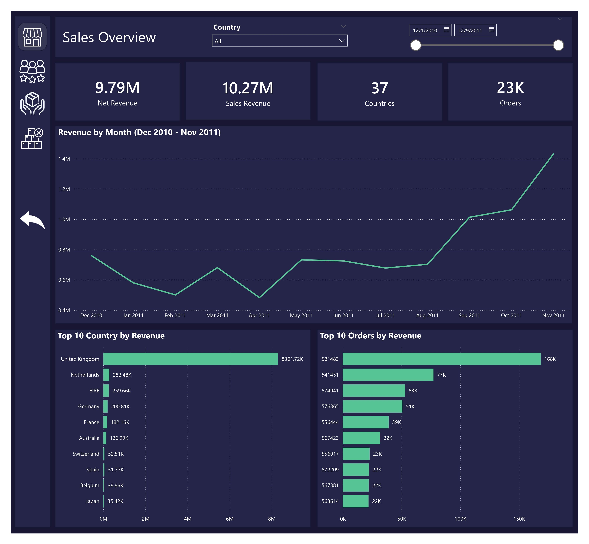
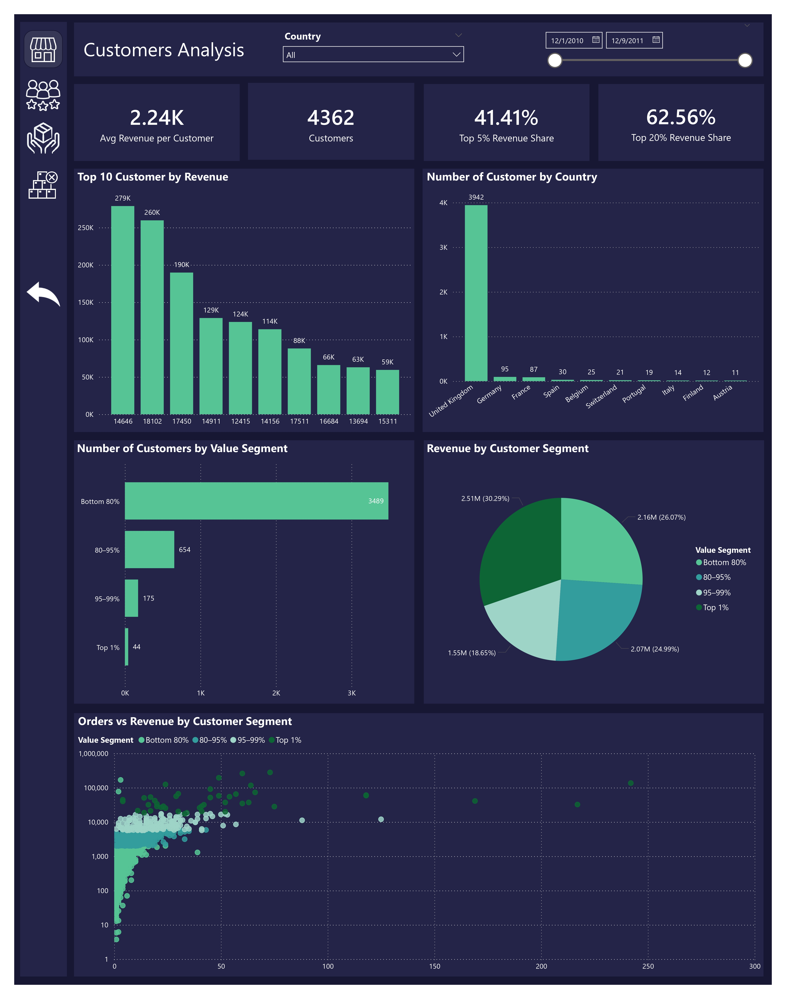
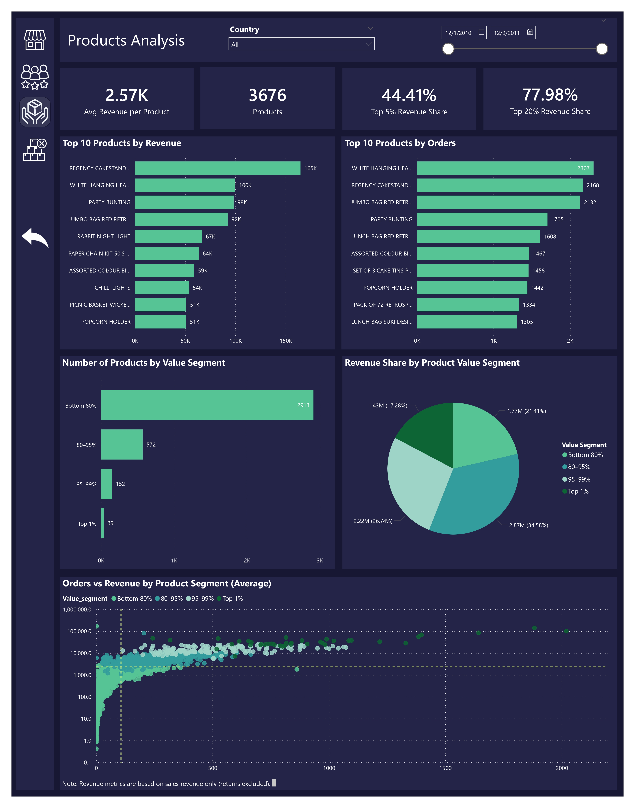
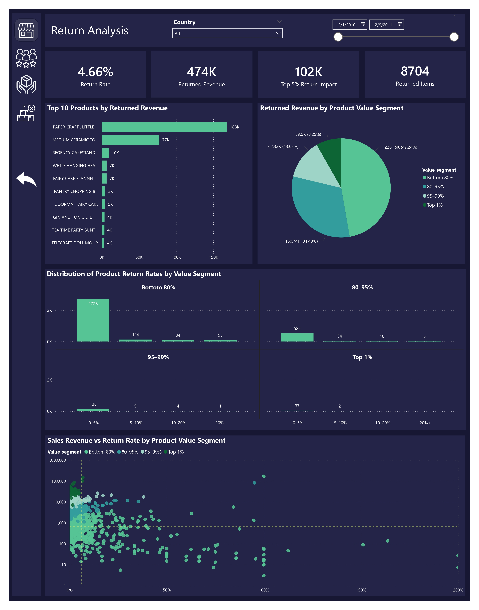

# Retail Sales Analysis – Python & Power BI

## Project Overview

This project analyzes an e-commerce retail dataset to evaluate business performance, customer behavior, product contribution, and return impact.

The project combines Python for advanced data cleaning and preprocessing, and Power BI for interactive dashboard development and business insights visualization.

---

## Business Objectives

- Analyze total revenue and sales trends
- Identify top-performing countries and products
- Segment customers and products by value contribution
- Evaluate return behavior and financial impact
- Improve data quality through advanced text standardization

## Project Workflow

1. Data cleaning and preprocessing using Python  
2. Product description standardization using text similarity (SequenceMatcher)  
3. Creation of business-ready datasets (Sales, Customers, Products, Returns)  
4. Data modeling in Power BI  
5. Creation of DAX measures and KPIs  
6. Interactive dashboard development  

## Tools & Technologies

- Python (Pandas, NumPy)
- Matplotlib / Seaborn
- Power BI
- DAX (Data Analysis Expressions)

## Data Cleaning & Preparation (Python)

- Classified transactions (Sale, Return, System Adjustment)
- Cleaned and standardized product descriptions
- Detected and merged inconsistent product labels using text similarity
- Segmented Customers, Products, and Returns based on value contribution
- Filtered valid commercial transactions
- Calculated Revenue (Quantity × UnitPrice)
- Exported structured datasets (Sales, Customers, Products, Returns) for BI modeling
- Conducted exploratory analysis in Python to validate and prepare data before BI modeling.

## Power BI Dashboard

The Power BI report includes four analytical sections:

### Sales Overview
- Total Revenue
- Monthly Revenue Trend
- Top Countries by Revenue
- Top Orders by Revenue

### Customers Analysis
- Revenue per Customer
- Customer Value Segmentation
- Revenue Distribution by Segment
- Orders vs Revenue Scatter Analysis

### Products Analysis
- Top Products by Revenue
- Product Value Segmentation
- Revenue Concentration Analysis
- Orders vs Revenue Scatter

### Return Analysis
- Return Rate KPI
- Returned Revenue Impact
- Product Return Segmentation
- Sales vs Return Rate Distribution

## Key Insights

- The United Kingdom is the primary market, dominating both revenue and customer volume.
- Smaller markets (EIRE, Netherlands) show higher revenue per customer, indicating potential high-value or B2B behavior.
- Revenue is highly concentrated among a limited number of products (Pareto effect).
- High-sales products generate more returns in absolute terms, but return rates remain proportionally moderate.
- Extreme return rates are mostly observed among low-to-medium sales products, suggesting potential product-level issues.

## DAX Examples (Key Measures)

Below are examples of key DAX measures used to build KPIs and customer intelligence indicators.

### Net Revenue
```DAX
Net Revenue =
SUM(sales[Revenue])
```
### Sales Revenue
```DAX
Sales Revenue = 
CALCULATE(
    SUM(sales[Revenue]),
    sales[Revenue] > 0
)
```
### Returned Revenue
```DAX
Returned Revenue =
CALCULATE(
    SUM(sales[Revenue]),
    sales[TransactionType] = "Return"
)
```
### Return Rate
```DAX
Return Rate = 
DIVIDE(
    [Returned Revenue],
    [Sales Revenue]
)
```
### Average Revenue per Customer
```DAX
Avg Revenue per Customer =
DIVIDE(
    [Net Revenue],
    [Customers]
)
```
### Average Orders per Product
```DAX
Avg Orders  (Products) = 
AVERAGEX(
    VALUES(sales[StockCode]),
    [Orders]
)
```
### Revenue Share - Top 5% Customers
```DAX
Revenue Share – Top 5% Customers = 
VAR TopRevenue =
    CALCULATE(
        SUM(sales[Revenue]),
        Customers[Value_segment] IN {"95–99%", "Top 1%"}
    )
VAR TotalRevenue =
    SUM(sales[Revenue])
RETURN
DIVIDE(TopRevenue, TotalRevenue)
```
### Revenue Share - Top 20% Customers
```DAX
Revenue Share – Top 20% Customers = 
VAR TopRevenue =
    CALCULATE(
        SUM(sales[Revenue]),
        Customers[Value_segment] IN {"80–95%", "95–99%", "Top 1%"}
    )
VAR TotalRevenue =
    SUM(sales[Revenue])
RETURN
DIVIDE(TopRevenue, TotalRevenue)
```

## Dashboard Preview

### Sales Overview


### Customers Analysis


### Products Analysis


### Return Analysis


## Power BI File

The Power BI (.pbix) file can be provided upon request.

## Exported Datasets

- sales.csv
- customers.csv
- products.csv
- returns.csv

## Skills Demonstrated

- Data cleaning and preprocessing
- Text similarity and standardization
- Business KPI design
- DAX measure creation
- Dashboard storytelling
- Analytical reasoning
- End-to-end BI workflow

## Author

Mohamed Fakhri Ben Brahim  
Aspiring Data Analyst | Python | SQL | Power BI | DAX | Advanced Excel
